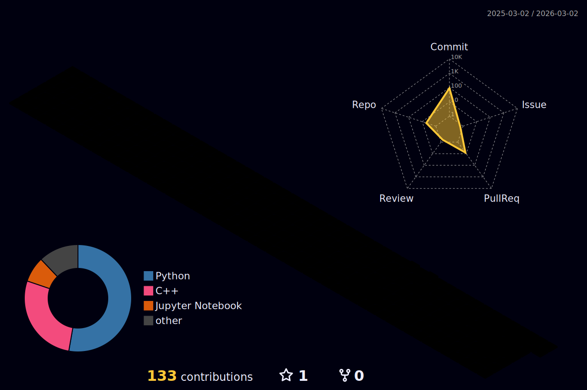

  

  

---

  <i>Designing state-of-the-art ML & DL models, optimizing NLP pipelines, and exploring Computer Vision.</i>

  
  

---

### 🧠 Research & Focus
- **Machine Learning Optimization:** Focusing on hyperparameter tuning and model compression.
- **Natural Language Processing:** Large Language Model (LLM) fine-tuning and tokenization strategies.
- **Computer Vision:** Advanced object detection and latent space representation.

---
### 🛠️ Technical Stack

| **Languages** | **AI & Data Science** |
| :---: | :---: |
|  |  |
|  |  |
|  |  |
|  |  |

---

  

---

### 📊 GitHub Analytics

  
   
  
  

  

---

 
<blockquote>
  "Words are pale shadows of forgotten names. As names have power, words have power." 
  — <i>Kvothe (The Name of the Wind)</i>
</blockquote>
 

